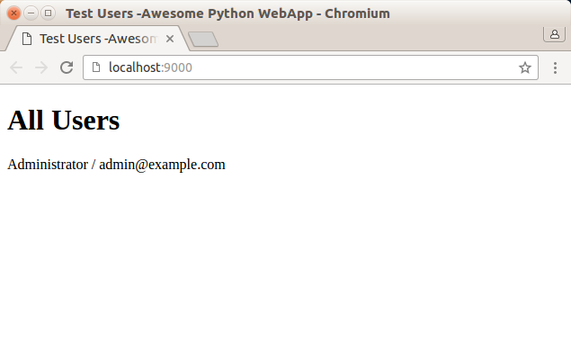

##day1-搭建开发环境

确认系统的Python版本

```
$ python --version
Python 2.7.12
```

搭建虚拟环境，并切换到虚拟环境

```
$ virtualenv venv
$ source venv/bin/activate
```

安装模板引擎JinJa2

```
$ pip install jinja2
```

安装MySQL驱动程序

```
$ pip install mysql-connector-python-rf==2.1.3
```

项目结构

```
awesome-python-webapp/   <-- 根目录
|
+- backup/               <-- 备份目录
|
+- conf/                 <-- 配置文件
|
+- dist/                 <-- 打包目录
|
+- www/                  <-- Web目录，存放.py文件
|  |
|  +- static/            <-- 存放静态文件
|  |
|  +- templates/         <-- 存放模板文件
|
+- LICENSE               <-- 代码LICENSE
|
+- README.MD
```

##day2-编写数据库模块

在一个Web APP中，所有数据，包括用户信息、发布的日志、评论等，都存储在数据库中，我们选择MySQL 作为数据库

Web App 中有很多地方都要访问数据库。访问数据库就需要创建数据库链接、游标对象，然后执行SQL 语句，最后处理异常、清理资源。这些访问数据库的代码如果分散到各个函数中，势必无法维护，也不利于代码复用

此外，在一个Web App 中，有多个用户会同时访问，系统以多线程或多进程模式来处理每个用户的请求。假设以多线程为例，每个线程在访问数据库时，都必须创建仅属于自身的链接，对别的线程不可见，否则就会造成数据库混乱

所以，我们还要创建一个简单可靠的数据库访问模型，在一个线程中，能既安全又简单的操作数据库

为什么不选择SQLAlchemy？因为它太过庞大，过度地面向对象设计导致API 太复杂。所以决定自己设计一个封装基本select、insert、update 和delete 操作的DB 模块:transwarp.db

>设计底层模块的原则是，根据上层调用者设计简单医用的API 接口，然后实现模块内部代码，而不是先实现内部代码，再考虑将什么样的接口暴露给用户！

在MySQL 中创建测试用的数据库

```
perfect@perfect:~$ mysql -u root -proot
mysql> create database awesome;
```

进行简单测试，在命令行输入以下命令：

```
perfect@perfect:~$ python db.py
```

不出意外的话，去MySQL 的awesome 数据库中检查会有一张新增的user 表

关于数据库模块的更详细的介绍，参见[《Day 2 - 编写数据库模块》](http://www.liaoxuefeng.com/wiki/001374738125095c955c1e6d8bb493182103fac9270762a000/0013976160374750f95bd09087744569be5aae6160c8351000)

另外关于Python装饰器、functools，继续学习[《装饰器》](http://www.liaoxuefeng.com/wiki/001374738125095c955c1e6d8bb493182103fac9270762a000/001386819879946007bbf6ad052463ab18034f0254bf355000)

##day3-编写ORM

有了db 模块，操作数据库直接写SQL 就很方便了。但是，我们还缺少ORM，有了ORM，就可以用类似这样的语句获取User 对象

```
user = User.get('123')
```

而不是写SQL然后再转换成User对象

```
u = db.select_one('select * from users where if = ?', '123')
user = User(**u)
```

和设计db模块类似，设计ORM也是从上层调用者角度来设计，我们先考虑如何定义一个User对象，然后把数据库表users 和它关联起来

```
from transwarp.orm import Model, StringField, IntegerField

class User(Model):
    __table__ = 'users'
    id = IntegerField(primary_key=True)
    name = StringField()
```

注意到定义在User类中的\_\_table\_\_、id和name是类的属性，不是实例的属性。所以，在类级别上定义的属性用来描述User对象和表的映射关系，而实例属性必须通过\_\_init\_\_()方法去初始化，所以两者互不干扰：

```
#创建实例
user = User(id=123, name='xumenger')
#存入数据库
user.insert()
```

##day4-编写Model

有了ORM，我们就可以把Web App 需要的3个表的Model 表示出来了

把SQL 脚本放到MySQL 命令行里执行：

```
$ mysql -u root -proot < schema.sql
```

执行单元测试：`python test_db.py`，输出结果如下

```
perfect@perfect:~/Desktop/MyWork/github/annotation.awesome.webapp/www$ python test_db.py 
WARNING:root:NOTE: change primary key to non-updatable.
WARNING:root:NOTE: change primary key to non-updatable.
WARNING:root:NOTE: change primary key to non-updatable.
new user id: 001473602291603d0e5c2d3587443d3b0d4f72a2d15fd09000
find user's name:  Test
find user:  None
```

##day5-编写Web框架

在开始正式Web 开发之前，我们需要编写一个Web 框架。为什么不选择一个现成的Web 框架而是自己从头开始呢？我们来考察一下现有的流行的Web 框架：

* Django：一站式开发框架，但不利于定制化
* web.py：使用类而不是最简单的函数来处理URL，并且URL 映射是单独配置的
* Flask：使用@decorator 的URL 路由不错，但是框架对应用程序的代码入侵太强
* bottle：缺少根据URL 模式进行拦截的功能，不利于权限检查

因为HTTP 是典型的请求--响应模式的网络协议，所以对应要实现Request 和Response 类，简单说来，HTTP 服务器很简单：

* 收到客户端的HTTP 请求
* 解析请求报文
* 按照请求生成对应的响应信息
* 按照HTTP 协议的规范对响应信息进行打包
* 将HTTP 响应报文发回给客户端

##day6-添加配置文件

有了Web 框架和ORM 框架，我们就可以开始装配App 了

通常，一个Web App 在运行时都需要读取配置文件，比如数据库的用户名、口令等，在不同的环境中运行时，Web App 可以通过读取不同的配置文件来获得正确的配置

由于Python 本身语法简单，完全可以直接用Python 源代码来实现配置，而不需要再解析一个单独的.properties 或者.yaml 等配置文件

默认的配置文件应该完全符合本地开发环境，这样，无需任何设置，就可以立刻启动服务器

##day7-编写MVC

现在，ORM框架、Web框架和配置都已就绪，我们可以开始编写一个最简单的MVC，把它们全部启动起来

之前已经安装好Jinja2 等，所以这里直接启动服务器

```
$ python wsgiapp.py
```

然后在浏览器中输入`http://localhost:9000/`，可以看到下面的内容，如果users 表中没有数据，需要插入一些测试数据



##需要补习的知识点

* day2练习中对应的Python 的装饰器、functools的知识
* day3练习中对应的Python 的元类的知识
* day5练习中对应的Python WSGI、正则表达式、Jinja2模板的使用的知识
* day5练习中涉及到的HTTP 网络协议工作原理的细节知识，扩展了解HTML、CSS、JS在Web中所处的位置和作用！
